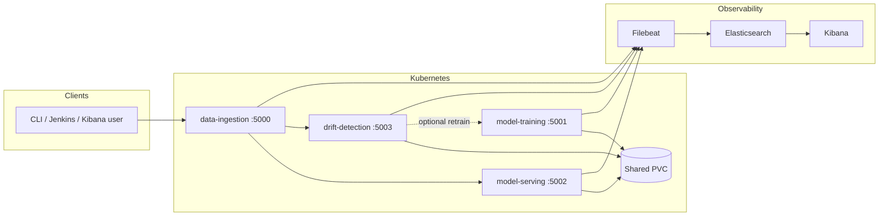

# SPE Final Project – Drift-Aware Churn Prediction Pipeline

This repository is a **software platform engineering** project centered on **data drift detection** for a bank **customer churn** use case. Four **Flask** microservices run in **Docker** / **Kubernetes**, with **Jenkins** CI/CD, optional **Ansible** provisioning, and **ELK** (Elasticsearch, Filebeat, Kibana) for logs and dashboards.

**Core idea:** each **ingested** batch is scored for drift against distributions saved at training time (`reference_distribution.pkl`). The drift service returns **`drift_detected`** (`true` / `false`). When drift is detected and **`TRAINING_URL`** is configured on the drift service, it **automatically calls `POST /train`** with the same payload so the model can be refreshed. **Data ingestion** always invokes drift as part of `POST /ingest`, so retraining is tied to the ingestion path whenever drift fires and `TRAINING_URL` is set.

Supporting pieces: **training** establishes the reference and model on a shared PVC; **serving** returns predictions. All services emit **structured JSON logs** for observability.

---

## What the system does

1. **Model training** reads labeled churn data (CSV on a shared volume or JSON in the request body), fits a **scikit-learn** pipeline (preprocessing + **logistic regression**), writes **`churn_model.pkl`** and **`reference_distribution.pkl`** to the PVC, and logs training lifecycle events (`training_run_started`, `training_run_completed`, `training_run_failed`).
2. **Drift detection** compares each live batch to the saved reference (per-feature **KS-style** tests vs. synthetic draws from the reference mean/std, plus **label distribution** drift on `Exited`). The JSON response includes **`drift_detected`** (boolean) and **`details`**. If **`drift_detected`** is **`true`** and **`TRAINING_URL`** is set, the service **POSTs that URL** (your training service’s `/train`) with the batch JSON to retrain.
3. **Model serving** loads the pickle model from the PVC and returns predictions and churn probabilities for rows that match the expected feature schema (`Exited` is ignored if present).
4. **Data ingestion** validates the **full churn schema**, then calls **serving** and **drift** (`SERVING_URL`, `DRIFT_URL`). The HTTP response includes **`drift_response`**, which is the drift JSON (for example **`drift_response.drift_detected`**).



---

## Innovative Idea: Self-Explaining Drift (Root Cause Analysis)

Most MLOps pipelines stop at **Drift Detection** (knowing *if* the data changed). This project introduces **Self-Explaining Drift** via a dedicated **Root Cause Analysis (RCA)** service.

### Why is this innovative?
*   **Bridging the Gap**: Statistical drift (like KS-test) often flags features that don't actually affect the model's accuracy. Our RCA service uses **SHAP (Explainable AI)** to verify if the drifted features are actually "Rogue Features"—those that are now driving the model's decisions more than they did during training.
*   **Actionable Insights**: Instead of a blind "drift detected" alert, the system provides a **Visual Dashboard** and a **Plain English Explanation** (e.g., *"Age is the rogue feature causing this drift"*).
*   **Smart Retraining**: It prevents unnecessary retraining by identifying whether the drift is benign or requires immediate intervention.

---

## Microservices overview

| Service | Port (default) | Role |
|--------|------------------|------|
| **Data ingestion** | 5000 | `POST /ingest` — validate payload, call serving + drift; response includes **`drift_response`** (with **`drift_detected`**). Logs as `service.name: ingest`. |
| **Model training** | 5001 | `POST /train` — fit model + reference; `GET /health` for compose healthchecks. |
| **Model serving** | 5002 | `POST /predict` — load model from PVC, return predictions. |
| **Drift detection** | 5003 | `POST /drift` — returns `drift_detected` + `details`; calls **`TRAINING_URL`** (retrain) when drift is detected and that env var is set. |
| **Root Cause Analysis** | 5004 | `POST /run-rca` — calculates SHAP influence shifts to identify "rogue" features; `GET /dashboard` — visualizes drift insights. |

---

## Architecture and tech stack

| Layer | Technology |
|-------|------------|
| APIs | Python **Flask** |
| ML / XAI | **pandas**, **numpy**, **scipy**, **scikit-learn**, **SHAP** (RCA service) |
| Containers | **Docker** |
| Orchestration | **Kubernetes** |
| Innovative Idea | **Self-Explaining Drift**: Automatic Root Cause Analysis using SHAP to identify "Rogue Features" driving distribution changes. |
| Logs / dashboards | **Elasticsearch**, **Kibana**, **Custom RCA Dashboard** (Port 5004/dashboard) |
| Security | **Ansible Vault** (AES-256) |

**Shared storage:** Kubernetes **PersistentVolume** / **PersistentVolumeClaim** mounts the same path (`/data/churn-model`) into training, serving, and drift pods so artifacts and `train.csv` are shared.

---

## Project structure

```
SPE_FINAL_PROJECT/
├── data_ingestion/          # Ingest API + tests
├── model_training/          # Train API, health, tests
├── model_serving/             # Predict API + tests
├── drift_detection/           # Drift API + tests
├── kubernetes/
│   ├── deployment/          # Per-microservice Deployments
│   ├── service/             # ClusterIP Services
│   ├── pv.yaml, pvc.yaml
│   ├── hpa.yaml
│   └── elk/                   # Elasticsearch, Kibana, Filebeat, dashboards, setup Job
├── ansible/                   # Roles, inventory, Vault secrets
├── tests/
│   └── test_integration.py    # pytest-style pipeline checks (optional locally)
├── docker-compose.test.yml    # Local stack for Jenkins / manual testing
├── requirements.txt           # Python deps for tests / tooling
└── Jenkinsfile
```

---

## API reference — all endpoints

Base URLs depend on how you run the stack (`http://localhost:<port>`, `kubectl port-forward`, or `minikube service ...`). Paths below are **relative to each service’s base URL**.

### Data ingestion (`:5000`)

| Method | Path | Description |
|--------|------|-------------|
| `POST` | `/ingest` | JSON **array of objects** (or a single object) with the **full** churn schema (see below). On success, forwards to `SERVING_URL` and `DRIFT_URL`, returns combined JSON. |

**Required columns (each row):** `CustomerId`, `CreditScore`, `Geography`, `Gender`, `Age`, `Tenure`, `Balance`, `NumOfProducts`, `HasCrCard`, `IsActiveMember`, `EstimatedSalary`, `Exited`.

**Optional headers:** `X-Source` / `x-source` (or `source` on a dict body) for log metadata.

---

### Model training (`:5001`)

| Method | Path | Description |
|--------|------|-------------|
| `POST` | `/train` | If the body is a JSON **list** of rows with `Exited`, `Geography`, and `Gender`, trains on that data. Otherwise falls back to **`train.csv`** on the PVC. Saves model + reference distribution. |
| `GET` | `/health` | Returns service health (used by Docker Compose `depends_on` healthcheck). |

Training emits structured events including `training_run_started`, `training_run_completed`, and `training_run_failed`.

---

### Model serving (`:5002`)

| Method | Path | Description |
|--------|------|-------------|
| `POST` | `/predict` | JSON **object** (one row) or **array** of objects with prediction features. **`Exited` is dropped** if present. Requires all of: `CreditScore`, `Geography`, `Gender`, `Age`, `Tenure`, `Balance`, `NumOfProducts`, `HasCrCard`, `IsActiveMember`, `EstimatedSalary`. Optional: `CustomerId`. |

**Optional headers:** `X-Client-Source` / `x-client-source` for log metadata.

---

### Drift detection (`:5003`)

| Method | Path | Description |
|--------|------|-------------|
| `POST` | `/drift` | JSON array or object of rows (same style as ingestion). Compares to **`reference_distribution.pkl`**. Response includes **`drift_detected`** (boolean) and **`details`**. If reference is missing, returns a clear JSON message. If **`drift_detected`** is **`true`** and **`TRAINING_URL`** is set, the service **`POST`s that URL** with the same JSON body to retrain. |

**Response shape (success):** `{"drift_detected": <bool>, "details": { ... }}` and, when a retrain call was made, **`"training_response": { ... }`** (the JSON body returned by **`POST /train`**).

On **`POST /ingest`**, the same drift payload appears under **`drift_response`**, for example **`drift_response.drift_detected`**.

---

### Root Cause Analysis (`:5004`)

| Method | Path | Description |
|--------|------|-------------|
| `POST` | `/run-rca` | Analyzes SHAP influence shifts for `drifted_features`. Returns a "Rogue Feature" report. |
| `GET` | `/dashboard` | Interactive UI to visualize drift insights and SHAP comparison charts. |

---

## Drift payloads: `drift_detected: false` vs `true`

Train **once** with a fixed reference (inline JSON is easiest so you know what the reference looks like):

```bash
export BASELINE='[{"CustomerId":1,"CreditScore":600,"Geography":"France","Gender":"Male","Age":30,"Tenure":5,"Balance":1000,"NumOfProducts":1,"HasCrCard":1,"IsActiveMember":1,"EstimatedSalary":40000,"Exited":0},{"CustomerId":2,"CreditScore":650,"Geography":"Germany","Gender":"Female","Age":45,"Tenure":1,"Balance":5000,"NumOfProducts":2,"HasCrCard":0,"IsActiveMember":0,"EstimatedSalary":50000,"Exited":1}]'
curl -sS -X POST "$TRAIN/train" -H "Content-Type: application/json" -d "$BASELINE"
```

### Payload that should yield `drift_detected: false`

Re-send **the same distribution** you trained on (same two rows as `BASELINE`). Feature and label summaries stay aligned with the saved reference, so drift is usually **not** flagged:

```bash
export NO_DRIFT="$BASELINE"
curl -sS -X POST "$DRIFT/drift" -H "Content-Type: application/json" -d "$NO_DRIFT" | tee /tmp/drift-no.json
# Expect: "drift_detected": false
grep -o '"drift_detected": [^,]*' /tmp/drift-no.json
```

**Note:** per-feature checks compare your batch to a **random** sample drawn from the reference Gaussian; p-values can vary slightly between calls. If you ever see a rare `true`, call again with the same `NO_DRIFT` or use a slightly larger batch that still matches training.

### Payload that should yield `drift_detected: true`

Send rows that are **far outside** the training distribution (extreme ages, balances, credit scores, and skewed labels). This pattern is intentionally harsh and normally triggers drift (and therefore a retrain when `TRAINING_URL` is set):

```bash
export export DRIFT_HEAVY='[{"CustomerId":901,"CreditScore":300,"Geography":"France","Gender":"Male","Age":95,"Tenure":50,"Balance":999999,"NumOfProducts":1,"HasCrCard":0,"IsActiveMember":0,"EstimatedSalary":200000,"Exited":1},{"CustomerId":902,"CreditScore":250,"Geography":"France","Gender":"Male","Age":99,"Tenure":40,"Balance":888888,"NumOfProducts":1,"HasCrCard":0,"IsActiveMember":0,"EstimatedSalary":250000,"Exited":1},{"CustomerId":903,"CreditScore":700,"Geography":"Germany","Gender":"Female","Age":45,"Tenure":10,"Balance":5000,"NumOfProducts":2,"HasCrCard":1,"IsActiveMember":1,"EstimatedSalary":60000,"Exited":0}]'
curl -sS -X POST "$DRIFT/drift" -H "Content-Type: application/json" -d "$DRIFT_HEAVY" | tee /tmp/drift-yes.json
# Expect: "drift_detected": true
grep -o '"drift_detected": [^,]*' /tmp/drift-yes.json
```

### Through ingestion (same `drift_detected` semantics)

After `BASELINE` training, **`drift_response`** on ingest mirrors **`POST /drift`**:

```bash
curl -sS -X POST "$INGEST/ingest" -H "Content-Type: application/json" -d "$NO_DRIFT" | grep -o '"drift_detected": [^,]*'
curl -sS -X POST "$INGEST/ingest" -H "Content-Type: application/json" -d "$DRIFT_HEAVY" | grep -o '"drift_detected": [^,]*'
```

If **`TRAINING_URL`** points at your training service, the second ingest (heavy drift) should also include a **`training_response`** field inside **`drift_response`** from the drift service’s retrain call.

---

## Testing commands

Set a reusable **valid row** (matches integration tests and Jenkins):

```bash
export ROW='[{"CustomerId":15634602,"CreditScore":619,"Geography":"France","Gender":"Female","Age":42,"Tenure":2,"Balance":0,"NumOfProducts":1,"HasCrCard":1,"IsActiveMember":1,"EstimatedSalary":101348,"Exited":0},{"CustomerId":15634603,"CreditScore":608,"Geography":"Spain","Gender":"Female","Age":41,"Tenure":1,"Balance":83807,"NumOfProducts":1,"HasCrCard":0,"IsActiveMember":1,"EstimatedSalary":112542,"Exited":1}]'
```

### Local URLs (Docker Compose or port-forward to the same ports)

```bash
export INGEST=http://localhost:5000
export TRAIN=http://localhost:5001
export PREDICT=http://localhost:5002
export DRIFT=http://localhost:5003
```

For worked examples of **`drift_detected: false`** vs **`true`**, use the **Drift payloads** section (train with `BASELINE`, then `NO_DRIFT` / `DRIFT_HEAVY`) before the generic **`ROW`** curls below.

### 1. Health (training only)

```bash
curl -sS "$TRAIN/health"
```

### 2. Train (bootstrap model + reference on PVC)

Empty JSON array uses CSV on the volume:

```bash
curl -sS -X POST "$TRAIN/train" -H "Content-Type: application/json" -d '[]'
```

Train from inline labeled data (at least two classes in `Exited`):

```bash
curl -sS -X POST "$TRAIN/train" -H "Content-Type: application/json" -d "$ROW"
```

**Intentional training failure** (missing required columns for training validation):

```bash
curl -sS -X POST "$TRAIN/train" -H "Content-Type: application/json" -d '[{"CustomerId":1,"CreditScore":600}]'
```

### 3. Predict

```bash
curl -sS -X POST "$PREDICT/predict" -H "Content-Type: application/json" -H "X-Client-Source: readme-test" -d "$ROW"
```

**Invalid body** (400):

```bash
curl -sS -X POST "$PREDICT/predict" -H "Content-Type: application/json" -d '42'
```

**Missing feature** (500, validation error):

```bash
curl -sS -X POST "$PREDICT/predict" -H "Content-Type: application/json" \
  -d '[{"CreditScore":619,"Geography":"France","Gender":"Female","Tenure":2,"Balance":0,"NumOfProducts":1,"HasCrCard":1,"IsActiveMember":1,"EstimatedSalary":101348}]'
```

### 4. Drift (run after a successful train so reference exists)

```bash
curl -sS -X POST "$DRIFT/drift" -H "Content-Type: application/json" -d "$ROW"
```

### 5. Ingest (full pipeline: validate → serving + drift)

```bash
curl -sS -X POST "$INGEST/ingest" -H "Content-Type: application/json" -H "X-Source: readme-test" -d "$ROW"
```

**Validation failure** (400):

```bash
curl -sS -X POST "$INGEST/ingest" -H "Content-Type: application/json" -d '{}'
```

### 6. Kibana / Elasticsearch smoke (generate log volume for dashboards)

After training at least once, repeat **predict**, **drift**, and **ingest** a few times, then open Kibana with a time range covering **Last 15 minutes** (or **Last 24 hours**). Per-service dashboards filter by `service.name` (`ingest`, `predict`, `train`, `drift`); hitting each endpoint directly ensures every service’s panels receive events.

---

### 6. Root Cause Analysis (XAI)

**Terminal Mode:**
```bash
curl -X POST http://localhost:5004/run-rca \
  -H "Content-Type: application/json" \
  -d '{"drifted_features":["Age","Balance"]}'
```

**Dashboard Mode (Recommended):**
Open your browser to: `http://localhost:5004/dashboard`

---

### 7. Simulation: Ingesting from `test.csv`

**Scenario A: Normal Ingestion (No Drift)**
This reads the first 10 rows of your test data and sends them as a live batch.
```bash
python3 -c "import pandas as pd, requests, json; \
df = pd.read_csv('data/churn-model/test.csv').head(10); \
payload = df.to_dict(orient='records'); \
r = requests.post('http://localhost:5000/ingest', json=payload); \
print(json.dumps(r.json(), indent=2))"
```

**Scenario B: Forced Drift (Triggering RCA)**
This script skews the data (Extreme Age + 0 Balance) to force the system to detect drift and trigger the Root Cause Analysis report.
```bash
python3 -c "import pandas as pd, requests, json; \
df = pd.read_csv('data/churn-model/test.csv').head(10); \
df['Age'] = 95; df['Balance'] = 0; \
payload = df.to_dict(orient='records'); \
r = requests.post('http://localhost:5000/ingest', json=payload); \
print(json.dumps(r.json(), indent=2))"
```

---

## Automated tests (repository)

**Unit tests (same set as Jenkins `Run Unit Tests`):**

```bash
python3 -m venv venv
. venv/bin/activate
pip install -r requirements.txt
python3 -m unittest data_ingestion/tests/test_ingestion.py
python3 -m unittest drift_detection/tests/test_drift_detection.py
python3 -m unittest model_serving/tests/test_serving.py
python3 -m unittest model_training/tests/test_training.py
```

**Integration tests (`tests/test_integration.py`)** expect all four services on `localhost:5000–5003` and use **pytest** + **requests** (install if needed: `pip install pytest requests`):

```bash
pytest tests/test_integration.py -v
```

---

## Setup and installation

### Build Docker images

```bash
docker build -t kirtinigam003/model_training:latest ./model_training
docker build -t kirtinigam003/model_serving:latest ./model_serving
docker build -t kirtinigam003/drift_detection:latest ./drift_detection
docker build -t kirtinigam003/data_ingestion:latest ./data_ingestion
```

### Run locally (Docker Compose)

Compose wires `SERVING_URL` and `DRIFT_URL` to the host IP; training must become healthy before serving and drift start.

```bash
export HOST_IP=$(hostname -I | awk '{print $1}')
docker compose -f docker-compose.test.yml up --build
```

### Kubernetes

**Storage**

```bash
kubectl apply -f kubernetes/pv.yaml
kubectl apply -f kubernetes/pvc.yaml
```

**Applications**

```bash
kubectl apply -f kubernetes/deployment/
kubectl apply -f kubernetes/service/
```

**Live patching (rolling updates)** — Kubernetes **rolling updates** on every app `Deployment` (`kubernetes/deployment/*.yaml`):

- **`readinessProbe`** on **`GET /health`** (all four services on ports **5000–5003**) so a pod is not marked **Ready** until Flask responds; the Service only routes traffic to Ready endpoints.
- **`data-ingestion`** (no PVC): **`maxUnavailable: 0`**, **`maxSurge: 1`** — a new pod can start while old pods still serve traffic, then old pods are drained after the new one is Ready (**no deliberate overlap requirement on storage**).
- **`model-serving`**, **`drift-detection`**, **`model-training`** (share **`ReadWriteOnce`** PVC): **`maxSurge: 0`**, **`maxUnavailable: 1`** — only one pod may hold the volume at a time on typical storage drivers, so the rollout replaces pods **one after another**. There can be a **short window** with no Ready endpoint for that Deployment (often a few seconds); that is the usual trade-off with RWO + a single volume.
- **`livenessProbe`** on **data-ingestion**, **model-serving**, and **drift-detection** only. **Model training** has **readiness only** (no liveness): long **`POST /train`** is heavy; the app uses **`threaded=True`** so **`/health`** stays responsive during training, and omitting liveness avoids killing the pod mid-job.

Patch to a new image (example — replace tag with yours):

```bash
kubectl set image deployment/data-ingestion data-ingestion=kirtinigam003/data_ingestion:newtag
kubectl set image deployment/model-serving model-serving=kirtinigam003/model_serving:newtag
kubectl set image deployment/drift-detection drift-detection=kirtinigam003/drift_detection:newtag
kubectl set image deployment/model-training model-training=kirtinigam003/model_training:newtag
```

Watch the rollout finish (new pods Ready, old pods terminated):

```bash
kubectl rollout status deployment/data-ingestion
kubectl rollout status deployment/model-serving
kubectl rollout status deployment/drift-detection
kubectl rollout status deployment/model-training
```

Inspect rollout history and roll back if needed:

```bash
kubectl rollout history deployment/model-serving
kubectl rollout undo deployment/model-serving
kubectl describe deployment model-serving | tail -n 25
```

While **data-ingestion** rolls out (multiple replicas + surge), traffic can stay on older pods until new ones are Ready. For **PVC-backed** services with a **single replica**, expect a brief gap when the old pod terminates before the new one becomes Ready.

**Horizontal Pod Autoscaler (HPA)** — scales **data-ingestion**, **model-serving**, and **drift-detection** only (`kubernetes/hpa.yaml`). **Model training** is intentionally left at a fixed replica count so long-running training jobs are not duplicated by the autoscaler.

```bash
kubectl apply -f kubernetes/hpa.yaml
```

HPA decisions need **resource metrics** (CPU/memory). Your cluster must expose the **Metrics API** (for example **metrics-server**). Examples:

```bash
# Minikube
minikube addons enable metrics-server

# Any cluster — quick check that metrics.k8s.io is available
kubectl get apiservices 2>/dev/null | grep metrics.k8s.io || true
kubectl top nodes
kubectl top pods
```

Inspect autoscalers and events:

```bash
kubectl get hpa
kubectl describe hpa model-serving-hpa
kubectl describe hpa data-ingestion-hpa
kubectl describe hpa drift-detection-hpa
```

Watch replica changes (use a second terminal while you generate load):

```bash
kubectl get pods -l app=model-serving -w
kubectl get hpa model-serving-hpa --watch
```

Summary of what is defined in `kubernetes/hpa.yaml`:

| HPA name | Deployment | Metric | Target | Min → max replicas |
|----------|--------------|--------|--------|---------------------|
| `model-serving-hpa` | `model-serving` | CPU | average 60% utilization | 2 → 10 |
| `data-ingestion-hpa` | `data-ingestion` | Memory | average 70% utilization | 1 → 4 |
| `drift-detection-hpa` | `drift-detection` | CPU | average 80% utilization | 1 → 3 |

**Testing HPA under load** (after `kubectl port-forward` or via a URL reachable from your machine; export `ROW` / `DRIFT_HEAVY` / `BASELINE` as in the sections above):

Set bases if you use something other than localhost (must match your port-forwards):

```bash
export PREDICT="${PREDICT:-http://127.0.0.1:5002}"
export INGEST="${INGEST:-http://127.0.0.1:5000}"
export DRIFT="${DRIFT:-http://127.0.0.1:5003}"
```

#### Bash `while` loops (no Apache Bench required)

Use **one** terminal for load and **another** for `kubectl get hpa` / `kubectl get pods -w`. Stop load with **Ctrl+C** (single loop) or run the **“stop parallel workers”** command after the multi-worker snippets.

**1. Model serving (CPU)** — single tight loop:

```bash
while true; do
  curl -sS -o /dev/null -X POST "${PREDICT}/predict" \
    -H "Content-Type: application/json" \
    -d "$ROW"
done
```

**More CPU** — eight background `while` loops (stronger pressure for `model-serving-hpa`):

```bash
HPAPIDS=/tmp/hpa-serving-pids
: > "$HPAPIDS"
for _ in $(seq 1 8); do
  ( while true; do
      curl -sS -o /dev/null -X POST "${PREDICT}/predict" \
        -H "Content-Type: application/json" \
        -d "$ROW" || break
    done ) &
  echo $! >> "$HPAPIDS"
done
# When done observing HPA:
xargs -r kill < "$HPAPIDS" 2>/dev/null; rm -f "$HPAPIDS"
```

**2. Data ingestion (memory)** — single loop (raise pressure by opening **several** terminals each running the same loop, or use the 8-worker variant):

```bash
while true; do
  curl -sS -o /dev/null -X POST "${INGEST}/ingest" \
    -H "Content-Type: application/json" \
    -d "$ROW"
done
```

Parallel workers (memory HPA often needs sustained parallel traffic):

```bash
HPAPIDS=/tmp/hpa-ingest-pids
: > "$HPAPIDS"
for _ in $(seq 1 8); do
  ( while true; do
      curl -sS -o /dev/null -X POST "${INGEST}/ingest" \
        -H "Content-Type: application/json" \
        -d "$ROW" || break
    done ) &
  echo $! >> "$HPAPIDS"
done
# Stop:
xargs -r kill < "$HPAPIDS" 2>/dev/null; rm -f "$HPAPIDS"
```

**3. Drift detection (CPU)** — use a heavier payload (`DRIFT_HEAVY` from the drift section); single loop:

```bash
while true; do
  curl -sS -o /dev/null -X POST "${DRIFT}/drift" \
    -H "Content-Type: application/json" \
    -d "$DRIFT_HEAVY"
done
```

Parallel workers:

```bash
HPAPIDS=/tmp/hpa-drift-pids
: > "$HPAPIDS"
for _ in $(seq 1 8); do
  ( while true; do
      curl -sS -o /dev/null -X POST "${DRIFT}/drift" \
        -H "Content-Type: application/json" \
        -d "$DRIFT_HEAVY" || break
    done ) &
  echo $! >> "$HPAPIDS"
done
# Stop:
xargs -r kill < "$HPAPIDS" 2>/dev/null; rm -f "$HPAPIDS"
```

---

1. **Model serving (CPU)** — sustained concurrent `POST /predict` so average CPU crosses **60%**; watch `kubectl get hpa model-serving-hpa` and pod count for `app=model-serving`.

   Using **Apache Bench** (package `apache2-utils` on Debian/Ubuntu, or `httpd-tools` on Fedora/RHEL):

   ```bash
   printf '%s' "$ROW" > /tmp/predict-payload.json
   ab -n 50000 -c 80 -p /tmp/predict-payload.json -T application/json "${PREDICT}/predict"
   ```

   If `ab` is not installed, use the **`while` loops** above or any HTTP load tool (**hey**, **wrk**, **k6**).

2. **Data ingestion (memory)** — HPA targets **memory** utilization **70%**. Run **many concurrent** `POST /ingest` calls with a **large JSON body** (bigger batches or wider arrays) so the Flask + pandas path holds more resident memory; watch `kubectl get hpa data-ingestion-hpa` and pods with `app=data-ingestion`.

   Example pattern (adjust host and payload size; run several terminals or increase concurrency):

   ```bash
   seq 1 200 | xargs -P40 -I{} curl -sS -o /dev/null -X POST "${INGEST}/ingest" \
     -H "Content-Type: application/json" \
     -d "$ROW"
   ```

   Repeat in a loop until `kubectl top pods` shows ingestion memory pressure and HPA adds replicas.

3. **Drift detection (CPU)** — target **80%** CPU with concurrent `POST /drift` (heavier payloads increase work per request):

   ```bash
   seq 1 300 | xargs -P35 -I{} curl -sS -o /dev/null -X POST "${DRIFT}/drift" \
     -H "Content-Type: application/json" \
     -d "$DRIFT_HEAVY"
   ```

**Useful diagnostics if replicas do not move**

```bash
kubectl describe hpa model-serving-hpa | tail -n 30
kubectl get --raw "/apis/metrics.k8s.io/v1beta1/namespaces/default/pods" | head -c 500
```

Typical causes: metrics-server not installed, `resources.requests` / `limits` missing on pods (HPA uses requests for utilization), or not enough load duration (the default HPA sync interval is on the order of tens of seconds).

**Reach APIs from your machine (example)**

```bash
kubectl port-forward svc/data-ingestion-service 5000:5000
kubectl port-forward svc/model-training-service 5001:5001
kubectl port-forward svc/model-serving-service 5002:5002
kubectl port-forward svc/drift-detection-service 5003:5003
```

**ELK and dashboards (see `Jenkinsfile` ELK stage for full sequence)**

```bash
kubectl apply -f kubernetes/elk/elasticsearch.yaml
kubectl apply -f kubernetes/elk/filebeat.yaml
kubectl apply -f kubernetes/elk/kibana.yaml
kubectl apply -f kubernetes/elk/project-logs-es-mappings-configmap.yaml
kubectl apply -f kubernetes/elk/kibana-dashboard-config.yaml
kubectl delete job kibana-setup --ignore-not-found=true
kubectl apply -f kubernetes/elk/kibana-setup.yaml
kubectl wait --for=condition=complete job/kibana-setup --timeout=180s
```

---

## Secure storage (Ansible Vault)

Sensitive values live in **`ansible/vars/secrets.yml`** (encrypted).

### Edit secrets

```bash
ansible-vault edit ansible/vars/secrets.yml
```

### Run provisioning

```bash
ansible-playbook -i ansible/inventory.ini ansible/site.yml \
  --ask-vault-pass --ask-become-pass
```

---

## CI/CD pipeline (Jenkins)

High-level stages in `Jenkinsfile`:

1. **Environment setup** – Ansible playbook with Vault.  
2. **Run unit tests** – `unittest` for all four services.  
3. **Integration testing** – Docker Compose up, train with sample JSON, ingest with sample JSON.  
4. **Build & push** – Docker images to Docker Hub.  
5. **Deploy** – Kubernetes manifests.  
6. **ELK dashboard setup** – Apply ELK YAML, run `kibana-setup` Job (import dashboards, refresh index pattern).

---

## Notes

- **Training data:** For JSON training, the service checks that **`Exited`**, **`Geography`**, and **`Gender`** exist among the columns; include both churn classes in `Exited` when training from a small inline set.  
- **Order of operations:** Train (or ensure `churn_model.pkl` + `reference_distribution.pkl` exist on the PVC) before relying on **predict** or **drift**; **ingest** requires serving and drift endpoints to succeed.  
- **Drift and retraining:** Set **`TRAINING_URL`** on the drift service (for example the in-cluster URL for **`model-training-service`**) so that when **`drift_detected`** is **`true`**, **`POST /drift`** (and therefore ingest’s drift step) triggers **`POST /train`** with the ingested batch. Without **`TRAINING_URL`**, you still get **`drift_detected`** in JSON but no automatic retrain.  
- **Field name:** the API and logs use **`drift_detected`** (not `dirft_detected`).  
- **Logs:** Filebeat is configured to harvest only the four application pods and to decode JSON application logs into `project-logs-*` indices for Kibana.

---
